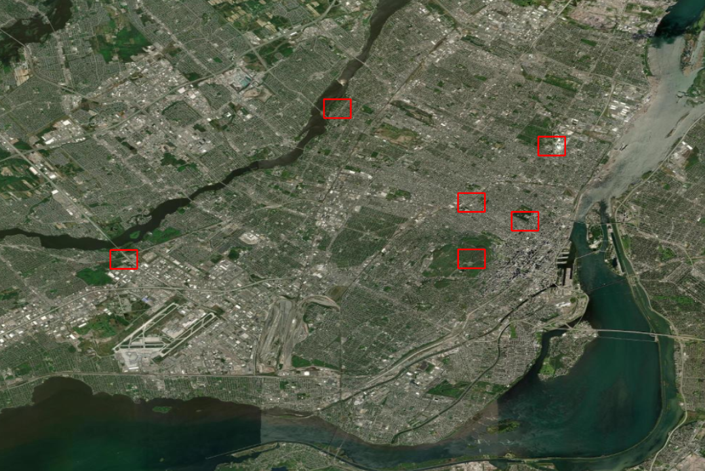

# Comparaison LiDAR 2015 et 2018

## Contexte
La classification des données LiDAR de 2015 et 2018 a été faite par 2 algorithmes différents, menant à des disparités dans les données.

## Objectif
Comparer les données sur plusieurs tuiles pour identifier les différences dans la classification des nuages de points.

## Données
- **LiDAR 2015** : disponible sur le portail des données ouvertes de la Ville de Montréal.
- **LiDAR 2018** : données sur disque physique, transmises par la Ville de Montréal lors du contrat pour la mise à jour de la carte de vulnérabilité face aux pluies abondantes de l'été 2024.

## Méthodologie
1. Télécharger une sélection de 5-6 tuiles LiDAR 2015 sur le portail des données ouvertes de la Ville de Montréal.
2. Convertir les fichiers `.LAZ` en `.LAS` :
    - Sur ArcGIS avec "Convertir des fichiers LAS", aucune compression, toutes les options LAS décochées, fichier LAS sans référence spatiale avec 32188 ou 2950 (4140 ne fonctionne pas).
3. Calculer des statistiques sur chaque tuile.
    - Sur ArcGIS avec "Statistiques d'un jeu de données LAS"
4. Comparer les statistiques entre 2015 et 2018 pour chaque tuiles

## Tuiles sélectionnées
- 299-5042 (sud-ouest du Parc La Fontaine)
- 297-5043 (ouest du parc Laurier)
- 297-5040 (Mont-Royal)
- 300-5046 (Parc Maisonneuve, stade olympique)
- 292-5048 (Parc-nature de l'Île-de-la-Visitation)
- 284-5040 (Parc-nature du Bois-de-Liesse)

## Comparaison

### 299-5042
| Classification     | Nb points 2015 | Nb points 2018 | Pourcentage 2015 | Pourcentage 2018 | Différence 2018-2015 |
|-------------------|----------------|----------------|------------------|------------------|----------------------|
| Tous              | 18.3 M         | 29.1 M         | 100 %            | 100 %            | x                    |
| Non classifié     | 4.6 M          | 6.4 M          | 25.37 %          | 22.14 %          | <mark>-3.23 %        |
| Végétation haute  | 2.3 M          | 12.6 M         | 12.34 %          | 43.2 %           | <mark>+30.86 %       |
| Bâtiments         | 5.4 M          | 6.8 M          | 29.28 %          | 22.27 %          | -7.01 %              |

### 299-5043
| Classification     | Nb points 2015 | Nb points 2018 | Pourcentage 2015 | Pourcentage 2018 | Différence 2018-2015 |
|-------------------|----------------|----------------|------------------|------------------|----------------------|
| Tous              | 21.1 M         | 24.2 M         | 100 %            | 100 %            | x                    |
| Non classifié     | 6.9 M          | 7.6 M          | 32.93 %          | 31.22 %          | <mark> -1.71 %       |
| Végétation haute  | 1.3 M          | 6.0 M          | 5.92 %           | 24.71 %          | <mark> +18.79 %      |
| Bâtiments         | 5.7 M          | 6.3 M          | 27.07 %          | 25.92 %          | -1.15 %              |

### 299-5040
| Classification     | Nb points 2015 | Nb points 2018 | Pourcentage 2015 | Pourcentage 2018 | Différence 2018-2015 |
|-------------------|----------------|----------------|------------------|------------------|----------------------|
| Tous              | 16.8 M         | 26.0 M         | 100 %            | 100 %            | x                    |
| Non classifié     | 1.4 M          | 8.2 M          | 8.47 %           | 31.57 %          | <mark>+23.1 %        |
| Végétation haute  | 1.9 M          | 8.9 M          | 11.51 %          | 34.46 %          | <mark>+22.95 %       |
| Bâtiments         | 2.9 M          | 3.9 M          | 17.8 %           | 14.88 %          | -2.92 %              |

### 300-5046
| Classification     | Nb points 2015 | Nb points 2018 | Pourcentage 2015 | Pourcentage 2018 | Différence 2018-2015 |
|-------------------|----------------|----------------|------------------|------------------|----------------------|
| Tous              | 21.1 M         | 24.2 M         | 100 %            | 100 %            | x                    |
| Non classifié     | 6.9 M          | 7.6 M          | 32.93 %          | 31.22 %          | <mark>-1.71 %        |
| Végétation haute  | 1.3 M          | 6.0 M          | 5.92 %           | 24.71 %          | <mark>+18.79 %       |
| Bâtiments         | 5.7 M          | 6.3 M          | 27.07 %          | 25.92 %          | -1.15 %              |

### 292-5048
| Classification     | Nb points 2015 | Nb points 2018 | Pourcentage 2015 | Pourcentage 2018 | Différence 2018-2015 |
|-------------------|----------------|----------------|------------------|------------------|----------------------|
| Tous              | 16.0 M         | 27.8 M         | 100 %            | 100 %            | x                    |
| Non classifié     | 4.5 M          | 6.0 M          | 28.04 %          | 21.66 %          | <mark>-6.38 %        |
| Végétation haute  | 3.0 M          | 14.6 M         | 18.88 %          | 52.69 %          | <mark>+33.81 %       |
| Bâtiments         | 2.3 M          | 3.0 M          | 14.02 %          | 10.81 %          | -3.21 %              |

### 284-5040
| Classification     | Nb points 2015 | Nb points 2018 | Pourcentage 2015 | Pourcentage 2018 | Différence 2018-2015 |
|-------------------|----------------|----------------|------------------|------------------|----------------------|
| Tous              | 17.0 M         | 31.7 M         | 100 %            | 100 %            | x                    |
| Non classifié     | 6.5 M          | 7.5 M          | 38.27 %          | 23.53 %          | <mark>-14.74 %       |
| Végétation haute  | 1.8 M          | 16.7 M         | 10.41 %          | 52.75 %          | <mark>+42.34 %       |
| Bâtiments         | 1.1 M          | 1.4 M          | 6.31 %           | 4.47 %           | -1.84 %              |

## Conclusion

Il y a une baisse globale du pourcentage de données non classifiés entre 2015 et 2018 sauf pour une des tuiles observées. Cette tuile représente une partie du Mont-Royal.
En contre partie, le nombre de points classifiés en "Végétation haute" augmente significativement entre les deux années avec une augmentation moyenne de 27% entre 2015 et 2018.

### Pistes expliquant ces différences

La forte différence de pourcentage de points classifiées en "Végétation haute" entre 2015 et 2018 peut s'expliquer par plusieurs facteurs. Le portail des données ouvertes de la Ville de Montréal reiseigne que le LiDAR 2015 a été mis à jour en novembre 2015. nous ne savons pas si cela signifie que la donnée a été produite ou traitée à cette période mais si c'est sa période de production, le manque de végétation expliquerait cette différences.
Pour valider cette théorie il faudrait avoir la date exacte de production de données pour le LiDAR 2015 et 2018.

## À faire pour le LiDAR
La taille de l'échantillion choisi ne permet pas d'emmetre de conclusion sur les différences de classification entre 2015 et 2018.
--> Trouver une solution pour faire ce résumer statistique pour toutes les tuiles.

- Pour chaque tuile:
  - Calculer les statistiques de 2015 et 2018
  - Calculer le poucentage de points "non classifiés"
  - Faire la différence de 2018 sur 2015
  - Relever le numéro des tuiles dont ce pourcentage est supérieur à 30%
 
  Recherches effectuées sur comment travailler avec des données LiDAR en Python :

Travailler avec la librairie *laspy*
  - https://laspy.readthedocs.io/en/latest/
  - https://laspy.readthedocs.io/en/latest/installation.html

--> Question posée à Rodolphe pour la méthodologie du code.

# Réponse de Rodolphe

resulats2015 = [] #Faire une liste vide
for t2015 in tuiles2015:
	resultats2015.append(calculsStats(t2015))

 ## Semaine du 03 mars: 

Reprise du Code pour le calcul automatique de la différence du pourcentage de point selon leur classification
 

Pour calculer sur toutes les tuiles, j'ai pensé à créer un google drive pour ajouter toutes les tuiles lidar. Trop lourd
--> télégarché Anaconda à la place pour travailler sur Jupyter.
--> j'ai ajouté les 149 premiéere tuiles pour le moment (296 à 279, reprendre à 280).

Finalement, reprise du code sur Spyder. Création d'un code qui calcul le pourcentage de point classifié en une classification "x" et intégration des résultats dans un DataFrame qui comprend une colonne renseignant le nom de la tuile calculé, et une colonne renseignant le résultat du calcule.

# 1er Prototype fonctionnel

	resultats2018 = []
	tuiles2018 = []

	def pourcentage2018(dossier):

    		for f in os.listdir(dossier):
        
        		if f.endswith('.las'):
            
            			chemin_fichier = os.path.join(dossier, f)
            
            
            		with lp.open(chemin_fichier) as g:
                
                		t2018 = g.read()
               
                		num_points = len(t2018)
                
                
                		num_points_classcode = len(t2018[t2018.classification == 5])
               
                		pourcentage_points_classecode = (num_points_classcode/num_points) *100
                
                		numero_tuile = f[:8]
               
                		resultats2018.append(pourcentage_points_classecode)
                
                		tuiles2018.append(numero_tuile)
                
                
                
    	return resultats2018, tuiles2018

	dossier = r"D:\UNIVERSITE\UQAM\Projet\DISQUE_5_DANS_8\LIDAR\TEST"
	resultats =  pourcentage2018(dossier)

	for pourcentage_points_classecode in resultats2018:
    		print(f"{pourcentage_points_classecode}% de points non classifiés")
	for numero_tuile in tuiles2018:
    		print(f"Tuile {numero_tuile}")

# Semaine du 10 mars :

Avancé du code, Code terminé avec un code pour calculer les pourcentage des points classifiés en "x" code de classe pour les tuiles 2018 : 

	import lazrs
	import pandas as pd
	import laspy as lp
	import os

	# Calcul du pourcentage de points classifiés en "x" code de classe pour l'année 2018:
    
	resultats2018 = [] # Liste vide contenant les réultats du calcule du pourcentage de points classifié selon "x" classecode

	tuiles2018 = [] # Liste vide contenant le nom de la tuile qui est calculé

	def pourcentage2018(dossier): # Fonction qui calcule
    
    		for f in os.listdir(dossier):
            
        		if f.endswith('.las'): # S'assurer que seuls les fichier .las sont sélectionnés
                
            		chemin_fichier = os.path.join(dossier, f)
                
            			with lp.open(chemin_fichier) as g: # Ouvrir le 
                    
               			t2018 = g.read()
                   
                		num_points = len(t2018) # Nombre de points dans la tuile
                
                		if num_points > 0: # Filtre pour ne pas diviser par 0 mais scénario impossible ici.
                    
                    			num_points_classcode = len(t2018[t2018.classification == 1]) # Nombre de points classifié selon le code de classe choisi
                   
                    			pourcentage_points_classecode = (num_points_classcode/num_points) *100 # Calcule du pourcentage
                    
                		else:
                    			pourcentage_points_classecode = 0.0
                
                		numero_tuile = f[:8] # Chercher le nom de la tuile (les 9 premiers caractères du fichier)
                   
                		resultats2018.append(pourcentage_points_classecode) # Ajouter le pourcentage à la liste resultats2018
                    
                		tuiles2018.append(numero_tuile) # Ajouter le nom de la tuile à la liste tuiles2018
                
    		df_resultats2018 = pd.DataFrame(
        	{'Tuile2018': tuiles2018,
         	'Pourcentage de points classifiés 2018 (Classe 1)': resultats2018
    		}) # Mettre le résultat des deux listes dans un dataframe
                    
                    
                    
    		return df_resultats2018

	dossier = r"D:\UNIVERSITE\UQAM\Projet\DISQUE_5_DANS_8\LIDAR_2018\LAS_classifiees\266-279"
	df_resultats_2018 =  pourcentage2018(dossier)

un second pour les tuiles 2015 : 

# Calcul du pourcentage de points classifié en "x" code de classe pour l'année 2015:
    
	resultats2015 = [] # Liste vide contenant les réultats du calcule du pourcentage de points classifié selon "x" classecode

	tuiles2015 = [] # Liste vide contenant le nom de la tuile qui est calculé

	def pourcentage2015(dossier): # Fonction qui calcule
    
   		for f in os.listdir(dossier):
            
        		if f.endswith('.las'): # S'assurer que seuls les fichier .las sont sélectionnés
                
            			chemin_fichier = os.path.join(dossier, f)
                
            			with lp.open(chemin_fichier) as g: # Ouvrir le 
                    
                		t2015 = g.read()
                   
                		num_points = len(t2015) # Nombre de points dans la tuile
                
                		if num_points > 0: # Filtre pour ne pas diviser par 0 mais scénario impossible ici.
                    
                    			num_points_classcode = len(t2015[t2015.classification == 1]) # Nombre de points classifié selon le code de classe choisi
                   
                    			pourcentage_points_classecode = (num_points_classcode/num_points) *100 # Calcule du pourcentage
                    
                		else:
                    			pourcentage_points_classecode = 0.0
                
                		numero_tuile = f[:8] # Chercher le nom de la tuile (les 9 premiers caractères du fichier)
                   
                		resultats2015.append(pourcentage_points_classecode) # Ajouter le pourcentage à la liste resultats2018
                    
                		tuiles2015.append(numero_tuile) # Ajouter le nom de la tuile à la liste tuiles2018
                
    		df_resultats2015 = pd.DataFrame(
        	{'Tuile2015': tuiles2015,
         	'Pourcentage de points classifiés 2015 (Classe 1)': resultats2015
    		}) # Mettre le résultat des deux listes dans un dataframe
                    
                    
                    
    		return df_resultats2015

	dossier = r"D:\UNIVERSITE\UQAM\Contrat\Comparaison_2015_2018\LiDAR_2015\LAS2015_classifiees_266-279"
	df_resultats_2015 =  pourcentage2015(dossier)

# 2ème échantillon de test.

Pour tester ce code j'ai fais un test sur un échantillon de données réduit comprenant 5 tuiles de 2015 et de 2018. Pour ce test je n'ai pas pris les meme tuiles pour 2015 et 2018 car je n'avais pas pour intention de soustraire les résultat par la suite. L'objectif était simplement de tester le code, et voir si les résultats étaient concoordant (si le résultats du calcule d'une tuile était bien sur la même ligne que le nom de la tuile correspondante). Le résultat était concluant pour les deux jeux de données (2015 et 2018). j'obtient dans les deux cas un dataframe contenant 2 colonnes : le nom de la tuile et le calcule du pourcentage voulu).

# 3ème échantillon de test

Les codes pour le calcul des pourcentage étant fonctionnel, j'ai ajouté une section fusionnant les deux dataframe en un. De sorte à avoir toutes les données dans un seul dataframe et pouvoir créer une nouvelle colonne résultante de la soustraction entre les résultats de 2018 et 2015 :

	# Fusion des 2 DataFrame et soustraction des résultats

	df_comparaison = df_resultats_2018.merge(df_resultats_2015[["Tuile2015", "Pourcentage de points classifiés 2015 (Classe 1)" ]], left_on="Tuile2018", right_on="Tuile2015", how="left")
	df_comparaison["Différence"] = df_comparaison["Pourcentage de points classifiés 2018 (Classe 1)"] - df_comparaison["Pourcentage de points classifiés 2015 (Classe 1)"]

	print(df_comparaison)

Apres quoi j'ai réalisé le premier test complet, sur un échantillon réduit : 

| Tuile      | 2015     | 2018     |
|------------|---------|---------|
| 295-5029   | ✅       | ❌       |
| 295-5030   | ✅       | ✅       |
| 295-5031   | ✅       | ✅       |
| 295-5032   | ✅       | ✅       |
| 295-5033   | ✅       | ✅       |
| 295-5034   | ❌       | ✅       |

j'ai choisi délibérément de prendre des données non-concordante à 100% entre 2015 et 2018 pour voir comment le code allait réagir lors de la fusion des 2 dataframe.
Résultat positif, le dataframe insert un "NaN" lorsqu'il ne peut pas effectuer la soustraction entre les résultats de 2018 et 2015. Aucun décalage dans les ligne du df.

# 4ème échantillon

Test de grande ampleur sur toutes les tuiles comprises entre 266-279. Succès pour 2015 mais pas pour 2018, un fichier semble etre corrompu. pour retrouver si le fichier est corrompu ou non, j'ai effectué le code suivant :

	dossier = r"D:\UNIVERSITE\UQAM\Projet\DISQUE_5_DANS_8\LIDAR_2018\LAS_classifiees\266-279"

	for f in os.listdir(dossier):
    		if f.endswith('.las'):
        	chemin_fichier = os.path.join(dossier, f)
       		 with open(chemin_fichier, "rb") as fichier:
            		signature = fichier.read(4)
        	print(f"{f} → Signature : {signature}")

Il permet de relevé la signature des fichiers. un fichier.Las doit avoir une signature = b'LASF'. Une tuile (279-5031) était corrompue. je l'ai retiré du dossier avant de relancer le code.

Succès

Le code suivant permet de transposer les résultats dans un csv. apres l'avoir ouvert sur Excel et réenregistré en csv il est ouvrable dans ArcGIS.

